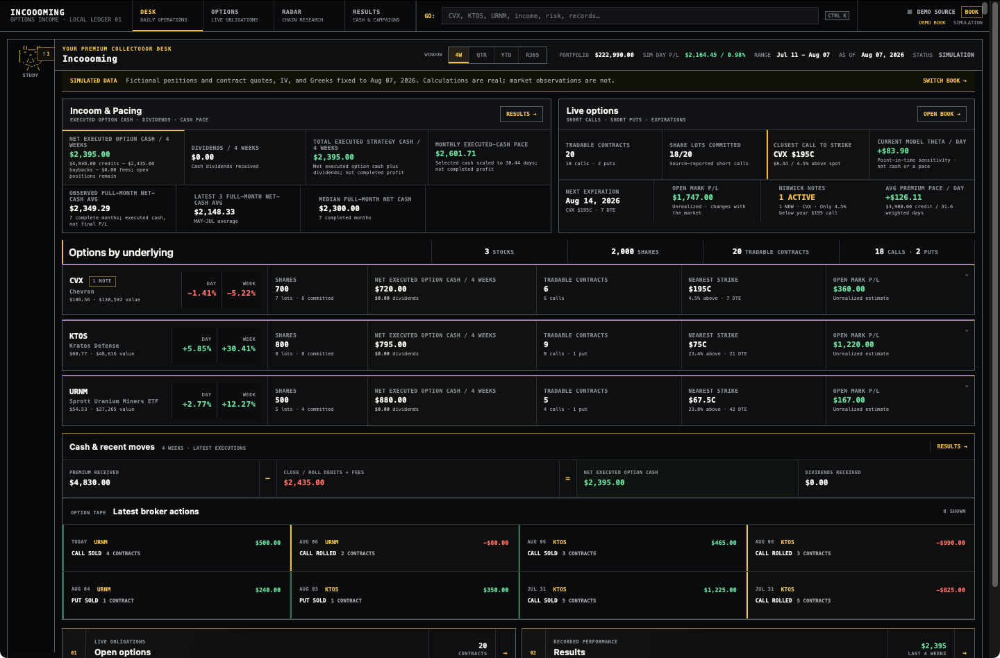
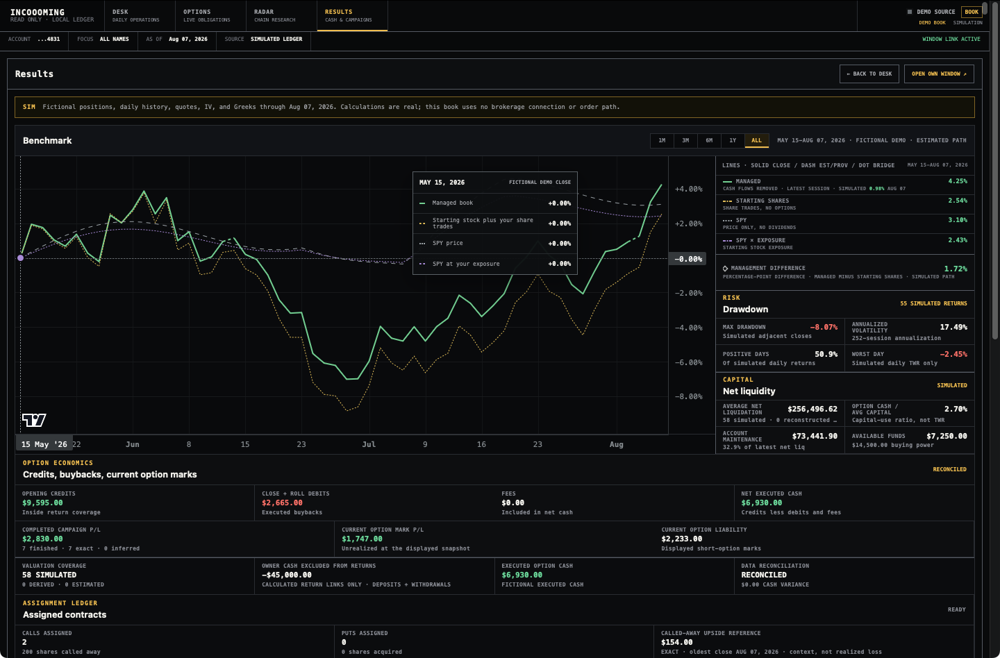

# Incoooming

**A personal dashboard for covered calls and cash-secured puts.**

I built Incoooming to track premium from my own covered calls and cash-secured puts. I wanted to
see the cash coming in, what was still at risk, and how the whole account was doing—all in one
place. I'm sharing it for anyone who wants that same context.

Free and open source. Runs locally on your computer. Reads data and never places trades.
This is an early beta, so start with the demo and check your own numbers against your broker.
Available for Windows and Mac. Mac CSV imports use Chrome.



## What you can see

| View | What it helps you answer |
| --- | --- |
| **Desk** | How much premium came in? What's open, and what's coming up? |
| **Options** | How close are my strikes? What would it cost to close or roll? What risk remains? |
| **Radar** | Which calls or puts fit the rules I chose? Why were other contracts filtered out? |
| **Results** | How is the account doing compared with the same starting shares plus share trades, SPY, and SPY at my starting stock exposure? |

The demo includes 18 calls, two puts, put roll-downs, model Greeks, and the full Results chart.
Its prices and returns are fictional, with a fixed August 7, 2026 date. You can explore it without
an account, API key, or brokerage connection.

<details>
<summary>See the demo's Results chart</summary>



These are made-up returns to show how the comparisons work.

</details>

## Try it

You'll need **Python 3.12, 3.13, or 3.14**. Supported setups are Windows 10/11 and
**macOS 15 on Apple Silicon and Intel**. See [what we tested on Mac](docs/platforms/macos-validation.md).

1. Get the project with GitHub's **Code → Download ZIP**. On Windows, choose **Extract All**;
   on Mac, double-click the ZIP. Git users can clone the repository instead.
2. Open the extracted folder containing this README and `scripts`. On Windows, type `powershell`
   in File Explorer's address bar and press Enter. On Mac, open Terminal, type `cd `, drag the
   project folder into the Terminal window, and press Enter.
3. Run these commands, one at a time. Wait for setup to finish successfully before starting the demo:

**Windows — PowerShell**

```powershell
.\scripts\bootstrap.cmd
.\scripts\run-demo.cmd
```

**Mac — Terminal**

```sh
sh ./scripts/bootstrap.sh
sh ./scripts/run-demo.sh
```

Open **[http://127.0.0.1:8182](http://127.0.0.1:8182)** in your browser. If you see the welcome
page, click **OPEN DEMO**. Start with **Results**, then explore the Desk and Options. Leave the
terminal open; press `Ctrl+C` there to stop the demo.

Need Python, a little more guidance, or help with an error? Follow the
[Windows setup guide](docs/getting-started.md) or [Mac setup guide](docs/getting-started-macos.md).

## Use your own data

Stop the standalone demo with `Ctrl+C` before switching to either of these paths.

**Connect Schwab:** get your own approved Schwab Individual Trader API app and follow the
[Windows connection guide](docs/getting-started-schwab.md) or
[Mac connection guide](docs/getting-started-macos.md#connect-schwab). Approval is controlled by
Schwab, so you can use the demo or CSV imports while you wait.

**Import CSV files:** run `.\scripts\run-local.cmd` on Windows or `sh ./scripts/run-local.sh`
on Mac, open the local address above, and choose
**BOOK → Import CSV**. Select your broker, preview the files, and review any skipped rows before
importing. On Mac, use **Chrome** for CSV imports; Safari file selection remains unverified.
You don't need API credentials for this path.

Recognized exports include Schwab and Fidelity positions/activity, Robinhood activity, Webull
order history, and IBKR Activity Statements. Each format provides different information; an order
history alone won't give you a complete current portfolio. CSV files don't provide live quotes,
option chains, Greeks, or the daily account history needed for the full benchmark chart.
See [supported files and examples](docs/getting-started.md#import-your-own-csv-files).

## Want your coding agent to help?

Open this project folder in your agent and paste this:

```text
Help me get Incoooming running on this computer. Read README.md and
the setup guide for my operating system (docs/getting-started.md for Windows,
docs/getting-started-macos.md for Mac). Check the OS and supported Python version,
then install the project dependencies and start the demo. Check that the
page opens and the Results chart works. Fix ordinary setup problems as you go.
On Mac, use Chrome for CSV import checks; don't assume Safari uploads are verified.

Once the demo works, ask whether I want to use CSV files or connect Schwab.
Follow the relevant guide and help me get to a working book. If Schwab approval
is still pending, leave me with a working demo or CSV setup and explain the
remaining step. Let me enter credentials and complete broker login privately;
don't ask me to paste secrets or authorization URLs into chat. Preserve any
existing settings and data, and keep the app on 127.0.0.1. Finish by telling me
what worked and the exact command to start it next time.
```

## A few things worth understanding

- **Premium received isn't the same as profit.** An open short option still costs money to close.
  Incoooming shows collected cash, the result of finished option trades, and the estimated result
  of open trades separately.
- **Returns describe the whole account.** Identified deposits and withdrawals are removed from
  returns. The comparison with starting shares includes share trades; the SPY line is price-only,
  without dividends. Estimated history is marked on the chart.
- **Missing information stays missing.** A dash means a required input is unavailable. Greeks are
  model estimates, and a roll quote is an estimate of both legs, not a guaranteed fill.
- **Your data stays on your computer.** Broker records are stored locally. Keep `.env`, `var/`,
  broker exports, and authorization links private. The app is intended for local use.

For the details behind a number, open its method notes or read
[How the numbers work](docs/accounting.md). Incoooming isn't investment or tax advice and has no
affiliation with Charles Schwab or the other brokers listed here.

## Feedback and contributions

Found something confusing or a number that looks wrong? Open an issue with the steps to reproduce
it and whether you used Demo, CSV, or Schwab. Use made-up examples and remove private details from
screenshots. Report security concerns through [SECURITY.md](SECURITY.md).

See [CONTRIBUTING.md](CONTRIBUTING.md) for development setup and checks, or browse the
[documentation](docs/README.md). The project uses the [MIT License](LICENSE);
bundled libraries are listed in [Third-party notices](THIRD_PARTY_NOTICES.md).
