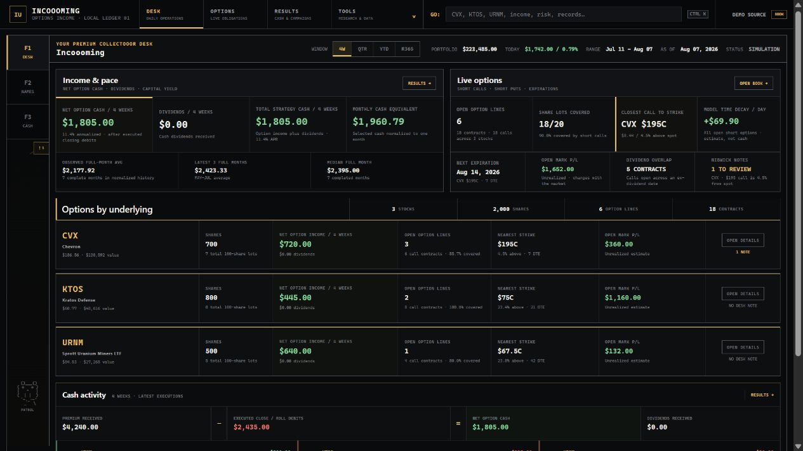

# Incoooming

Incoooming is a local Windows dashboard for covered calls and cash-secured puts. It keeps
executed cash, open option value, portfolio return, and source records separate so one number is
not presented as another.



## Beta status

This is an early self-hosted release. Use the demo first and compare live results with your broker
statements before relying on them. Incoooming does not place orders and is not investment, tax, or
accounting advice.

The live connector currently supports Schwab's Individual Trader API. Each user needs an approved
Schwab developer app. CSV imports support several brokers but remain limited to the fields in the
export.

## What it does

- Syncs Schwab accounts, positions, transactions, quotes, option chains, Greeks, and daily prices.
- Imports supported Schwab, Fidelity, Robinhood, Webull, and IBKR CSV exports into separate books.
- Tracks opening credits, closing and roll debits, fees, dividends, assignments, exercises, and
  expirations.
- Shows open calls and puts, strike distance, days to expiration, current marks, and model Greeks.
- Compares account return with starting shares and SPY reference paths.
- Keeps raw source records and reconciliation details in a local SQLite database.
- Includes a fictional demo that does not need a brokerage connection.

## Read the numbers correctly

`NET EXECUTED OPTION CASH` is opening credits minus executed closing or roll debits and fees. It is
cash flow, not profit. An open short option still has a liability that is shown separately at its
latest mark.

`COMPLETED CAMPAIGN P/L` includes the executed opening and closing legs of finished campaigns. It
stays blank when those campaign links do not reconcile.
`OPEN OPTION MARK P/L` estimates the result of still-open positions at the current broker mark.
Neither number is a tax calculation.

`ACCOUNT RETURN` is based on changes in broker net liquidation and removes identified owner
deposits and withdrawals. The Results chart uses solid green for broker-observed close-to-close
links. Dashed green marks position-replayed or otherwise estimated links. Dotted green is reserved
for an endpoint bridge when the stored data cannot support position replay. Reconstruction uses
known positions and activity when possible and does not turn a deposit into investment
performance. See [Accounting and chart methods](docs/accounting.md)
for the formulas and data-quality rules.

A dash means the broker input needed for that number is missing. Incoooming does not replace a
missing mark, cost basis, Greek, contract multiplier, or covered-capital value with zero. Roll cash
is not calculated unless the current option has a buy-to-close ask and the replacement has a bid.
Activity without an account identifier can fill a one-account history gap. In a multi-account book,
that gap stays blank rather than assigning the activity to the wrong account.

## Try the demo

Requirements: Windows 10 or 11 and Python 3.12, 3.13, or 3.14.

```powershell
.\scripts\bootstrap.cmd
.\scripts\run-demo.cmd
```

Open [http://127.0.0.1:8182](http://127.0.0.1:8182). Press `Ctrl+C` in the server window to stop it.
The server applies pending local database migrations before the desk starts. Demo mode uses its own
SQLite file and does not open or migrate the live Schwab ledger.
The demo's positions, option quotes, IV, and Greeks are deterministic fictional values fixed to
August 7, 2026. They exercise the real calculations and reconcile across contract, symbol, and
portfolio views, but they are not historical broker or exchange observations.

## Connect Schwab

The full instructions are in [Connect Schwab on Windows](docs/getting-started-schwab.md). The short
version is:

1. Create an approved Individual Trader API app in the
   [Schwab Developer Portal](https://developer.schwab.com/).
2. Register `https://127.0.0.1:8182/` as its callback URL.
3. Prepare the project and create a local settings file:

```powershell
.\scripts\bootstrap.cmd
Copy-Item .env.example .env
notepad .env
```

4. Add your app key and secret to `.env`, then run:

```powershell
.\scripts\connect-schwab.cmd
```

The script opens Schwab in your browser. After approval, the callback page may not load because no
HTTPS server is listening there. Copy its complete URL once; the script captures it from the
clipboard, exchanges the one-time code, syncs, and starts the local desk. A manual fallback is in
the full guide.

The local server refreshes after startup and every 15 minutes while it is running. It does not
install a Windows service. Use `.\scripts\restart-local.cmd` if the running copy is stale.

## Import CSV files

Open `BOOK`, choose `Import CSV`, select the broker, and preview the files before importing. An
import accepts up to eight files and 10 MB per file. Unsupported and uncertain rows stay out of the
ledger and remain visible in the import report.

For a safe test, import both files from [`examples/csv`](examples/csv) with the `Generic / template`
adapter. See the [CSV import contract](docs/systems/csv-import.md) for supported formats and limits.

## Local data and security

- The web server accepts IPv4 loopback hosts only. Do not expose it to a LAN or the internet.
- OAuth tokens are stored through Windows Credential Manager, not in the repository.
- `.env`, `var/`, SQLite files, and common key files are ignored by Git.
- The Schwab adapter contains read-only data calls. There are no order routes.
- Raw broker data can contain sensitive financial information. Do not attach it to a public issue.

Report security problems privately as described in [SECURITY.md](SECURITY.md).

## Development

```powershell
.\scripts\bootstrap.cmd
.\.venv\Scripts\python.exe -m ruff check .
.\.venv\Scripts\python.exe -m mypy
.\.venv\Scripts\python.exe -m pip_audit --local --skip-editable --progress-spinner off
.\.venv\Scripts\python.exe -m bandit -r src -q -s B101,B105
.\.venv\Scripts\python.exe -m pytest --cov=schwab_dashboard --cov-fail-under=80
```

JavaScript files are checked with Node when it is available:

```powershell
Get-ChildItem src/schwab_dashboard/web/static -Filter *.js -Recurse |
  ForEach-Object { node --check $_.FullName }
```

Contributions are welcome; read [CONTRIBUTING.md](CONTRIBUTING.md) first. Incoooming is available
under the [MIT License](LICENSE); bundled software is listed in
[Third-party notices](THIRD_PARTY_NOTICES.md). The rest of the technical and design documentation
is indexed in [docs/README.md](docs/README.md).
